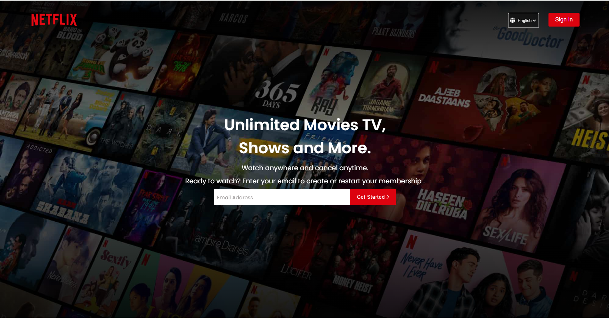

# Netflix Landing Page – HTML, CSS, JavaScript

This project is a front-end clone of the Netflix landing page created to practice and improve my skills in **HTML5, CSS3, and JavaScript**.  
The goal of this project was to understand how modern websites structure their layouts and how different UI components are built and styled.

---

## ⭐ Features

### 🎨 Responsive Layout
- Works across desktop, tablet, and mobile screens  
- Built using CSS Flexbox and media queries  

### 📺 Hero Section
- Background image banner with overlay  
- Email input with floating label  
- Clean call-to-action design  

### 📌 Feature Blocks
Recreated Netflix-style sections including:
- TV autoplay video section  
- Mobile download animation block  
- Watch-anywhere device showcase  
- Kids profile section  

### ❓ FAQ Accordion
- Click-to-expand FAQs  
- Smooth transitions using JavaScript  

### 🖼 Footer
- Multi-column footer with links  
- Language dropdown  
- Clean, Netflix-like layout  

---

## 🛠 Tech Stack
- **HTML5**  
- **CSS3 (Flexbox, Responsive Design)**  
- **JavaScript (Basic UI interactions)**  
- Google Fonts (Poppins)  
- Font Awesome Icons  

---

## 🚀 How to Run
1. Clone or download the repository  
2. Open the folder  
3. Run `index.html` in any browser  

No installation or backend setup needed.

## 📸 Project Screenshots

### 🏠 Home Page

### UI Screenshot 1

### UI Screenshot 2

### UI Screenshot 3

---

## 📁 Project Structure

